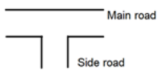

# Traffic Light Controller (FSM)
[](https://python.org)


## Contents
- [Case Studies](#case-studies)
  - [T-Section](#t-section-road)
- [Installation](#installation)
- [References](#references)

## Case Studies
### T-Section Road

In this case we will be studying a T-section road, where there will be a main road with 2
lanes, and a side road joining it.

 

In this road there will be four turns that will be requiring the assistance of a traffic light, they
are:

|Turn|Detail|
:---:|---
|`M1`| Crossing T-section of main road from left lane.|
|`MT`| Car turns from main left lane to side road.    |
|`M2`| Car Crossing the T-section from right lane     |
|`S` | Car Joining from side road to main road        |

So will have six states, it will go through them one by one after
their respective durations.


In the demo, only the durations for states `S1`, `S3` and `S5` are set.
For states `S2`, `S4` and `S6`, which are essentially a *yellow-light state*, the duration is defaulted to **2 secs**


## Installation
Make sure you have [pipenv](https://github.com/pypa/pipenv#installation) installed, then run following commands in the project directory.
1. Install dependencies
    ```bash
    pipenv sync
    ```
2. Run the project
    ```bash
    pipenv run python main.py
    ```

## References
1. https://en.wikipedia.org/wiki/Traffic_light_control_and_coordination
2. https://www.fpga4student.com/2016/11/verilog-code-for-traffic-light-system.html
3. https://www.watelectronics.com/how-traffic-light-control-system-works/
4. https://www.researchgate.net/publication/305674408_Smart_traffic_light_control_system

[back to top](#traffic-light-controller-fsm)
